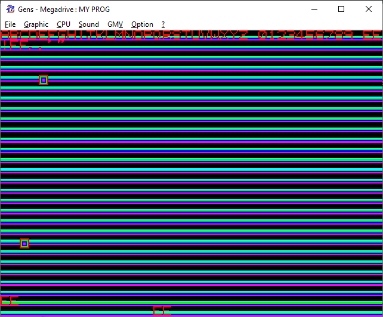

# **Mega Drive demo**
#### Sega Mega Drive/Genesis 68k assembler demo

Requires asm68k to build. For Windows, a batch file is provided. Simply copy ```asm68k.exe``` into the project root and run ```build.bat```

This will create a ```main.bin``` file that can be ran in any Mega Drive / Genesis emulator (or burned to an EPROM / flashcart and used with original hardware).



Demonstrates both scroll planes including tilemap fonts, animated hardware sprites, and sound via the Z80.
